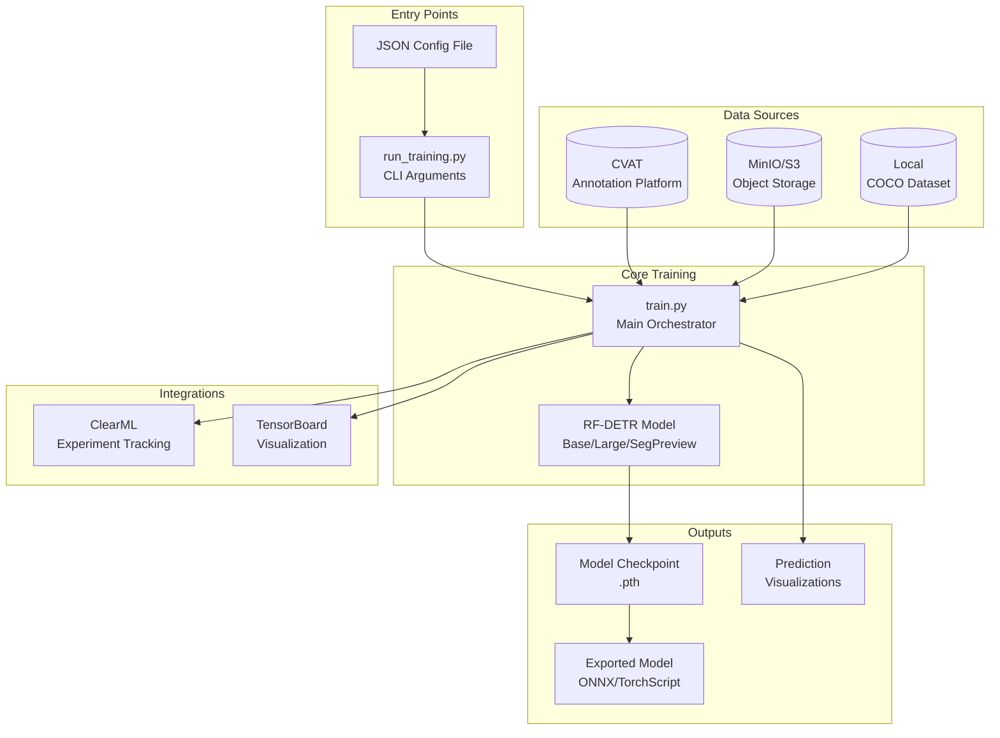
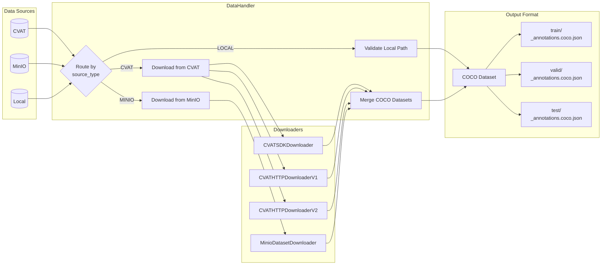
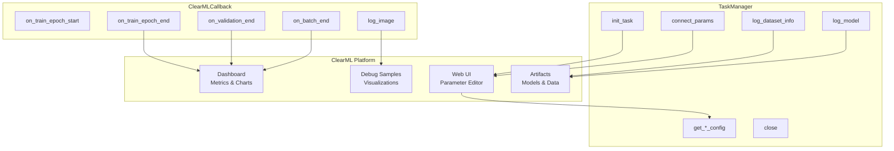
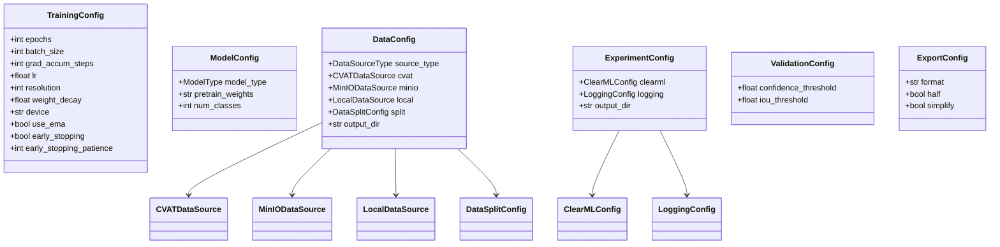
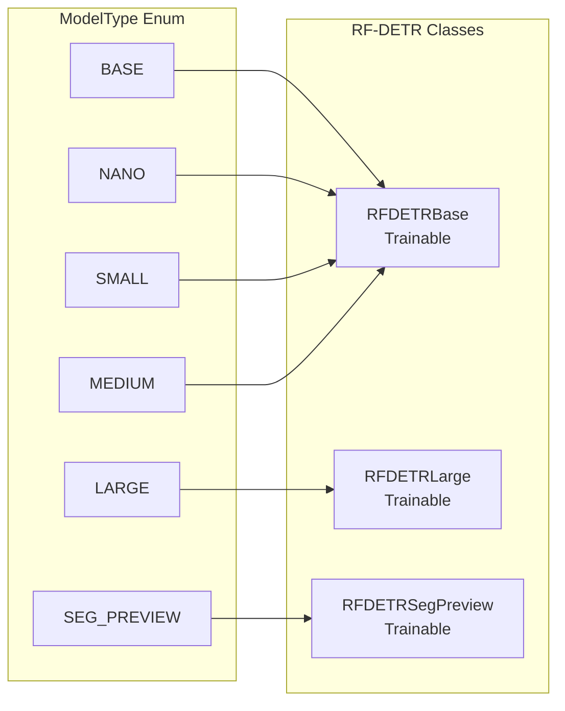

# RF-DETR Training Pipeline Workflow

This document describes the complete workflow of the RF-DETR training pipeline, including data flow, component interactions, and integration points.

## High-Level Overview



## Detailed Training Flow

```mermaid
flowchart TD
    START([Start]) --> PARSE[Parse CLI Arguments]
    PARSE --> BUILD[Build Configuration Schemas]
    BUILD --> INIT_CLEARML{ClearML<br/>Enabled?}

    INIT_CLEARML -->|Yes| TASK[Initialize ClearML Task]
    INIT_CLEARML -->|No| DATA
    TASK --> CONNECT[Connect Parameters to ClearML UI]
    CONNECT --> DATA

    DATA[Download/Prepare Dataset]
    DATA --> INFO[Extract Dataset Info<br/>Classes, Splits, Statistics]
    INFO --> LOG_DATA[Log Dataset Info]
    LOG_DATA --> INIT_MODEL[Initialize RF-DETR Model]

    INIT_MODEL --> TRAIN_LOOP[Training Loop]

    subgraph Training["Training Loop"]
        TRAIN_LOOP --> FORWARD[Forward Pass]
        FORWARD --> BACKWARD[Backward Pass]
        BACKWARD --> METRICS[Log Metrics]
        METRICS --> CKPT_CHECK{Checkpoint<br/>Interval?}
        CKPT_CHECK -->|Yes| SAVE_CKPT[Save Checkpoint]
        CKPT_CHECK -->|No| EARLY{Early Stopping<br/>Triggered?}
        SAVE_CKPT --> EARLY
        EARLY -->|No| EPOCH{More<br/>Epochs?}
        EARLY -->|Yes| BEST
        EPOCH -->|Yes| FORWARD
        EPOCH -->|No| BEST
    end

    BEST[Find Best Checkpoint]
    BEST --> LOG_MODEL[Log Model to ClearML]
    LOG_MODEL --> VIZ_CHECK{Save<br/>Predictions?}

    VIZ_CHECK -->|Yes| PREDICT[Generate Predictions]
    VIZ_CHECK -->|No| EXPORT_CHECK
    PREDICT --> ANNOTATE[Annotate Images]
    ANNOTATE --> LOG_VIZ[Log Visualization Grids]
    LOG_VIZ --> EXPORT_CHECK

    EXPORT_CHECK{Export<br/>Model?}
    EXPORT_CHECK -->|Yes| EXPORT[Export to ONNX/TorchScript]
    EXPORT_CHECK -->|No| CLOSE
    EXPORT --> CLOSE

    CLOSE[Close ClearML Task]
    CLOSE --> END([Return Best Checkpoint Path])
```



## Data Acquisition Flow



## ClearML Integration



## Configuration Schema Hierarchy



## Model Types



## Component Responsibilities

| Component | File | Responsibility |
|-----------|------|----------------|
| **CLI Entry** | `run_training.py` | Parse arguments, build schemas, invoke training |
| **Training Orchestrator** | `train.py` | Coordinate all training steps, model lifecycle |
| **Environment Config** | `config.py` | Load credentials from `.env` (CVAT, MinIO, ClearML) |
| **Data Handler** | `helpers/data_handler.py` | Download, merge, and prepare datasets |
| **CVAT Downloader** | `integrations/data/downloader_cvat.py` | Fetch datasets from CVAT (SDK/HTTP) |
| **MinIO Downloader** | `integrations/data/downloader_minio.py` | Fetch datasets from S3-compatible storage |
| **Task Manager** | `integrations/clearml/task_manager.py` | ClearML task lifecycle and parameter management |
| **Callbacks** | `integrations/clearml/callbacks.py` | Log training metrics and images to ClearML |
| **Visualization** | `helpers/visualization.py` | Generate prediction visualizations |
| **Schemas** | `schemas/*.py` | Type-safe Pydantic configuration models |
| **Default Params** | `configs/params.py` | Centralized default configuration values |

## Data Flow Summary

```
┌─────────────────────────────────────────────────────────────────────┐
│                         Parameter Flow                               │
├─────────────────────────────────────────────────────────────────────┤
│  CLI args → Schemas → TaskManager.connect_params() → ClearML UI     │
│                            ↓                                         │
│              TaskManager.get_*_config() → Training                   │
└─────────────────────────────────────────────────────────────────────┘

┌─────────────────────────────────────────────────────────────────────┐
│                           Data Flow                                  │
├─────────────────────────────────────────────────────────────────────┤
│  Source (CVAT/MinIO/Local) → Downloader → DataHandler → COCO        │
│                                              ↓                       │
│                                    model.train(dataset_dir)          │
└─────────────────────────────────────────────────────────────────────┘

┌─────────────────────────────────────────────────────────────────────┐
│                         Monitoring Flow                              │
├─────────────────────────────────────────────────────────────────────┤
│  model.train() → ClearMLCallback → Logger.report_* → ClearML UI     │
└─────────────────────────────────────────────────────────────────────┘
```

## Usage Examples

### Basic Local Training

```bash
uv run src/run_training.py \
    --dataset-dir ./data/my-dataset \
    --epochs 100 \
    --batch-size 8
```

### Training with CVAT Data

```bash
uv run src/run_training.py \
    --cvat-task-ids 123 456 789 \
    --project-name "MyProject" \
    --model-type large \
    --epochs 150
```

### Training without ClearML

```bash
uv run src/run_training.py \
    --dataset-dir ./data/my-dataset \
    --no-clearml \
    --tensorboard
```

### Full Configuration

```bash
uv run src/run_training.py \
    --cvat-task-ids 100 \
    --project-name "ObjectDetection" \
    --task-name "experiment-v1" \
    --model-type base \
    --epochs 200 \
    --batch-size 4 \
    --lr 0.0001 \
    --resolution 640 \
    --early-stopping \
    --early-stopping-patience 20 \
    --export-format onnx \
    --tags "production" "v1.0"
```
